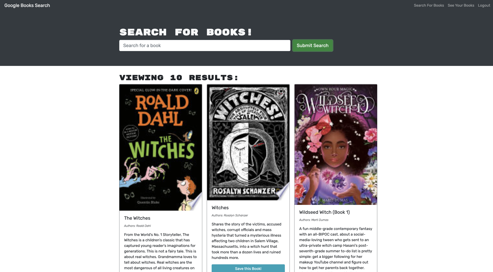

# Best Book Search

  
   
  
                     
   

  ## TABLE OF CONTENTS

  

  [Description](#description) *
  [Installation](#installation) *
  [Usage](#usage) *
  [Questions](#questions) *
  [License](#license)

   

    
  
   

  ## Description

  

  This is a book search app using Google Book Search API and GraphQL with a MongoDB database in a React App.
   
  Deployment: (https://fathomless-oasis-81248.herokuapp.com/)
   
  Repo: (https://github.com/sihayah/best-ever-book-search)

  

  ## Installation

  
  
  Clone the repo and run npm install from the root an integrated terminal.

   

## Usage

  

  Navigate to the deployment, sign-up, input the desired search option into the search bar, saved desired items by clicking save button, and view saved items by clicking "See your books".

   

  ## Questions

  

  For any further inquiries, please contact me via gitHub: [(sihayah)](https://github.com/sihayah) or email: sihayaharris@gmail.com

   

  

  ## License

  
  
  [click here for more information about  license.](https://opensource.org/licenses/ISC)
  

   
   
