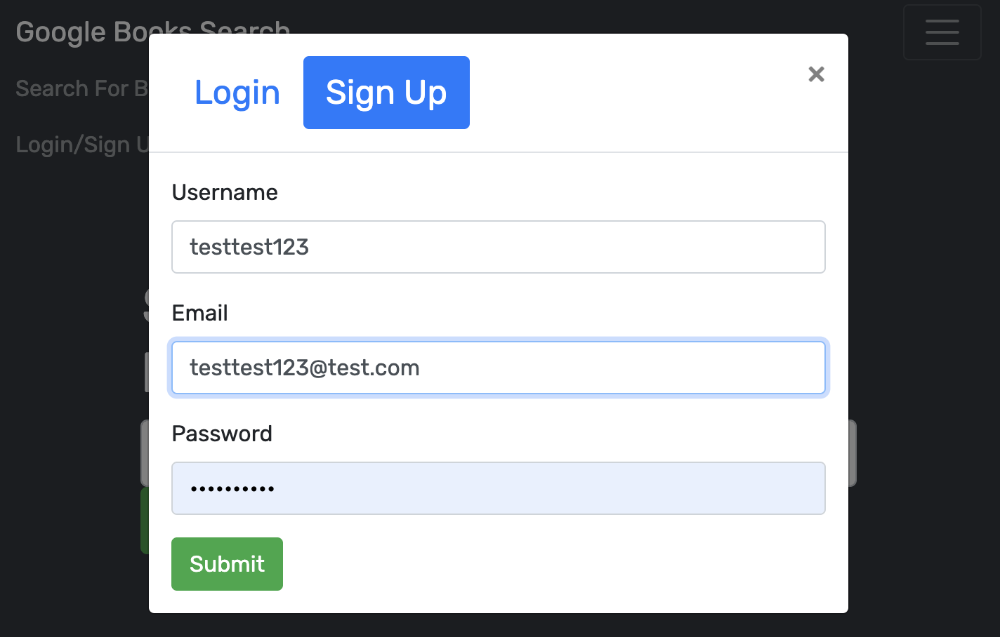

# Best Book Search

  
   
  
                     
   

  ## TABLE OF CONTENTS

  

  [User Story](#userstory) *
  [Features](#features) *
  [Technologies](#technologies) *
  [Prerequisites](#prerequisites) *
  [Installation](#installation) *
  [Usage](#usage) *
  [Questions](#questions) *
  [License](#license)

   

    

   
  Live: https://fathomless-oasis-81248.herokuapp.com/
   
  Repo: https://github.com/sihayah/best-ever-book-search
   
   

  ## UserStory

  AS AN avid reader
   
  I WANT to search for new books to read
   
  SO THAT I can keep a list of books to purchase

   

  ## Features

  This is a book search app using Google Book Search API and GraphQL with a MongoDB database in a React App. Typing in any keyword presents the user with related books, their author, and a short synopsis. When logged in, the user can save books to a list, and delete them from their list
   
   

  ## Technologies

  Following technologies were used in the production of this app:

  * HTML5
  * CSS3
  * JavaScript
  * Node.js
  * NPMs
  * Heroku
  * React
  * MongoDB
  * GraphQL
  * APIs

   

  ## Prerequisites

  Make sure you have the following installed on your development machine:

  Git - [Download & Install Git](https://git-scm.com/downloads)
   
  Node.js - [Download & Install Node.js](https://nodejs.org/en/download/)
   
  Visual Studio Code - [Download & Install VS Code](https://code.visualstudio.com/download)

   
  
  ## Installation

  To demo this app in a browser navigate to https://fathomless-oasis-81248.herokuapp.com/.

  To run this app locally, clone the repo. In a command line interface, navigate to the root of the repo. Run npm install to install all dependencies via the command line:

    npm install

Once sucessfully installed run following command:

    npm run develop

  If it's running correctly the following response should occur in your command line...

    

  You may then navigate to http://localhost:3000/ in your web browser.

   

## Usage

From the hamburger menu at the top of the screen select, sign-up to create a user.

Search the topic of your interest.

If desired, add book by selecting "Save this Book!".

By selecting the hamburger menu, you can access the link to "See Your Book".

...and you can see that your list has been populated with your selections, and you may delete them as you wish.

   

  ## Questions

  

  For any further inquiries, please contact me via gitHub: [(sihayah)](https://github.com/sihayah) or email: sihayaharris@gmail.com

   

  

  ## License

  
  
  [click here for more information about  license.](https://opensource.org/licenses/ISC)
  

   
   
